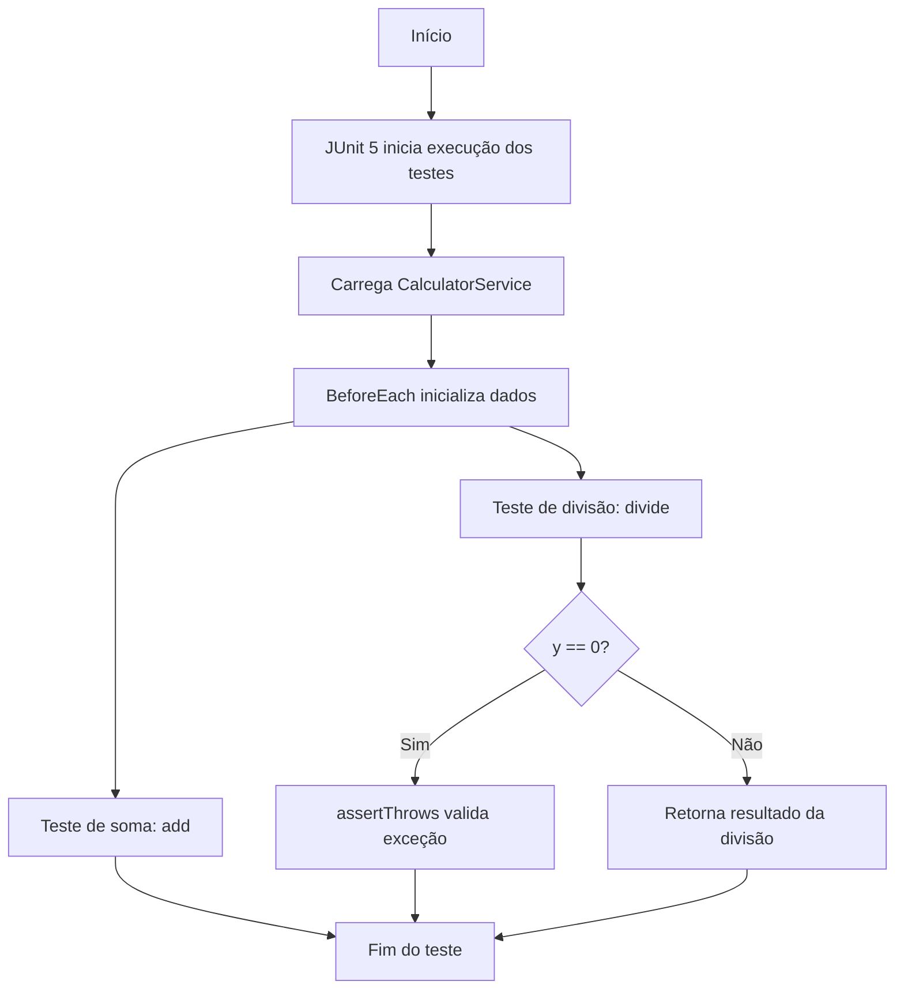

# 🧪 Spring Testing Demo

Projeto de exemplo para **testes unitários com JUnit 5** em uma aplicação Spring Boot.  
O objetivo é demonstrar como criar testes para serviços, usando **@BeforeEach**, **assertThrows** e boas práticas de teste.

---

## 📂 Estrutura do Projeto

```text
spring-testing-demo/
├── src/
│ ├── main/
│ │ └── java/com/example/springtestingdemo/service/CalculatorService.java
│ └── test/
│ └── java/com/example/springtestingdemo/service/CalculatorServiceTest.java
├── build.gradle.kts
└── README.md
```
---

## ⚙️ Funcionalidades

- **@BeforeEach**: Inicializa recursos antes de cada teste.
- **assertThrows**: Valida lançamento de exceções.
- **JUnit 5**: Framework de testes moderno e integrado ao Spring Boot.

---
## 🔍 Fluxo de Execução dos Testes



## 🚀 Como Executar

```bash

./gradlew test

```

## 📌 Exemplo de Saída

```vbnet

BUILD SUCCESSFUL in 2s
4 actionable tasks: 1 executed, 3 up-to-date

```

